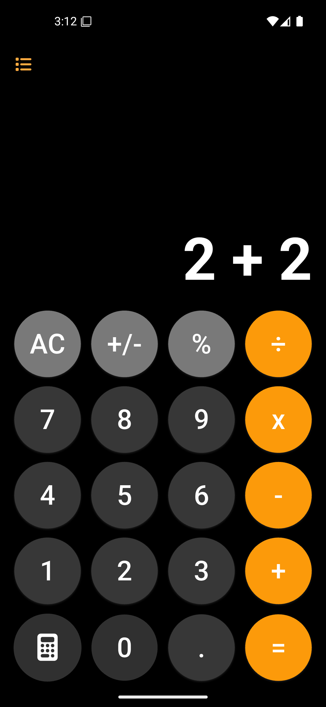
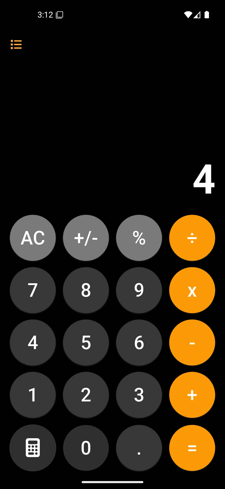

# 📱 Calculator App

A simple and elegant iOS-style calculator built using **Flutter**. The app follows the design of the default iOS calculator, providing essential arithmetic operations with a smooth user experience.


## 📱 Screenshots

 
 



## ✨ Features

- Basic arithmetic operations: **Addition, Subtraction, Multiplication, Division**
- iOS-style design and UI
- Responsive layout using `flutter_screenutil`
- Button press animation for better UX
- Memory functions like **AC (All Clear), +/- (Sign Change), and % (Percentage Calculation)**


## 📦 Dependencies

| Dependency             | Description                   |
|------------------------|-------------------------------|
| `flutter_screenutil`   | Handles responsive UI.       |
| `font_awesome_flutter` | Provides custom icons.       |
| `cupertino_icons`      | Includes iOS-style icons.    |


## Installation

1. Clone this repository:
   ```sh
   git clone https://github.com/yourusername/calculator_app.git
   ```

2. Install dependencies:
   ```sh
   flutter pub get
   ```

3. Run the app:
   ```sh
   flutter run
   ```

## 📌 To-Do (Future Enhancements)

- [ ] Implement history of calculations
- [ ] Add haptic feedback for button presses
- [ ] Replace the AC button with a backspace button when more than two values are entered.
- [ ] only operator sign button presses should do nothing